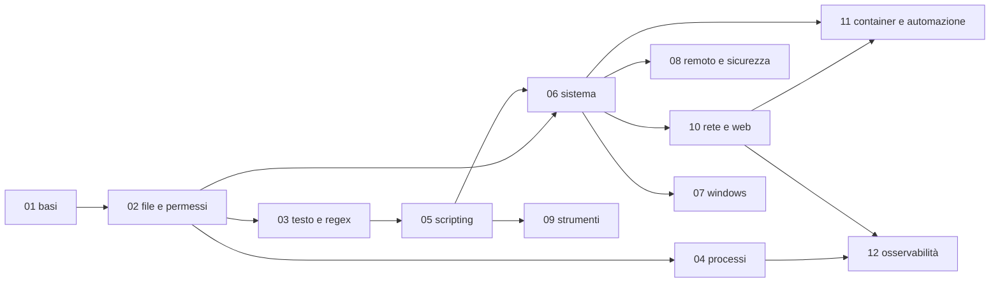

# Percorso di studio: in che ordine, quanto tempo, come capire che basta

L'[indice](../README.md) elenca tutto in ordine di cartella. Questa pagina serve a decidere **cosa fare davvero**, in che ordine, in quanto tempo, e **come accorgersi di aver capito** un'area prima di passare alla successiva.

## Come si studia un'area
1. **Leggi** i file nell'ordine del loro numero (il README dell'area li elenca).
2. **Prova** ogni comando nel laboratorio (`./lab.sh NN`): i file con i nomi degli esempi sono già lì. Se un esempio non dà il risultato descritto, non andare avanti: è il punto che non hai capito.
3. **Fai la prova di uscita** (in fondo a questa pagina, una per area): pochi compiti da risolvere **senza guardare il `.md`**. Dove l'area ha gli esercizi, la prova è farli passare tutti con `verifica.sh`.
4. Se la prova non riesce, rileggi **solo** il file indicato e ripetila. Un'area si chiude quando la prova riesce al primo colpo.

## I tempi
| Area | Parole | Lettura e prove | Esercizi | Totale |
|---|---|---|---|
| [01 basi](../01-basi/) | 6 000 | 1,5 h | | **1,5 h** |
| [02 file e permessi](../02-file-e-permessi/) | 8 000 | 2 h | 20 (2,7 h) | **4,5 h** |
| [03 testo e regex](../03-testo-e-regex/) | 6 500 | 1,6 h | 18 (2,4 h) | **4 h** |
| [04 processi](../04-processi/) | 7 500 | 1,9 h | 16 (2,1 h) | **4 h** |
| [05 scripting](../05-scripting/) | 8 600 | 2,1 h | 16 (2,1 h) | **4 h** |
| [06 sistema](../06-sistema/) | 14 500 | 3,6 h | 18 (2,4 h) | **6 h** |
| [07 windows](../07-windows/) | 10 800 | 2,7 h | | **3 h** |
| [08 remoto e sicurezza](../08-remoto-e-sicurezza/) | 10 900 | 2,7 h | 16 (2,1 h) | **5 h** |
| [09 strumenti](../09-strumenti/) | 17 200 | 4,3 h | | **4,5 h** |
| [10 rete e web](../10-rete-e-web/) | 15 200 | 3,8 h | 16 (2,1 h) | **6 h** |
| [11 container e automazione](../11-container-e-automazione/) | 58 300 | 14,6 h | | **15 h** |
| [12 osservabilità](../12-osservabilita/) | 13 200 | 3,3 h | | **3,5 h** |
| | | | | **circa 61 h** |

**Come sono calcolati.** Le parole sono quelle dei `.md` di ogni area (senza la cartella `lab/`). La lettura è `parole / 200` minuti **moltiplicata per 3**, per le prove nel laboratorio; per gli esercizi si contano 8 minuti ciascuno. Sono **stime a tavolino, non misurate** su chi studia: contale come un ordine di grandezza. La 11 da sola è un terzo delle parole della KB.

A 5 ore la settimana sono circa tre mesi per tutto; il [percorso base](#percorso-base-per-tutti) da solo sono circa 3 settimane.

## Cosa serve prima di cosa

Dipendenze vere, non solo di numerazione:
- la **05** usa `grep`, `sed`, `awk` e le redirezioni: fatela dopo 02 e 03;
- la **06** (servizi, utenti, cron) richiede di saper scrivere un piccolo script, quindi la 05;
- la **08**, la **10** e la **12** danno per noto `systemctl`, `journalctl` e gli utenti della 06; la 12 anche `ps`, `top` e `/proc` della 04;
- la **11** chiede la rete della 10 (porte, DNS, NAT) e i servizi della 06;
- la **07** si può studiare quando si vuole: è sul lato Windows (la parte Active Directory richiede Docker, come tutti i laboratori).

## Percorsi
Non servono tutte le 61 ore. Quattro scelte, ognuna comprende la precedente:

| Percorso | Aree | Ore | Per chi |
|---|---|---|---|
| **Base** | 01, 02, 03, 05 | circa 14 | chiunque usi un terminale |
| **Sviluppatore** | Base + 09 (`01-jq-e-curl`, `02-git`, `08-make`) + 11 (`01-docker`, `02-dockerfile`, `03-volumi-e-reti`, `04-compose`) | circa 16 | scrive applicazioni e le fa girare in locale |
| **Sistemista** | Base + 04, 06, 08, 10 | circa 35 | gestisce server Linux |
| **DevOps** | Sistemista + 09 + 11 + 12 | circa 58 | gestisce server e il codice che li descrive: tutto tranne la 07 (Windows) |

Le ore di ogni percorso sono la somma di quelle della tabella sopra (per lo Sviluppatore, solo i file elencati: 9 200 parole, 2,3 h di lettura e prove); sono stime allo stesso modo.

### Percorso base per tutti
01 → 02 → 03 → 05. Dopo questi quattro sapete muovervi, cercare, trasformare testo e scrivere uno script che non si rompe al primo nome con uno spazio.

### Cosa si può rimandare al secondo giro
Sono consigli, non regole:

| Area | Si rimanda | Perché |
|---|---|---|
| 02 | `06-dd`, `07-diff-e-rsync` | servono quando si copiano dischi o si sincronizzano cartelle |
| 04 | `05-debug-e-prestazioni` | `strace`, `perf` e i cgroup hanno senso dopo aver visto un problema vero |
| 06 | `10-logrotate`, `11-backup`, `12-storage-avanzato` | si leggono quando serve il backup o un disco da aggiungere |
| 08 | `05-sicurezza-sistema` | AppArmor, `auditd` e `lynis` sono un secondo livello dopo `ufw` e `fail2ban` |
| 09 | tutto tranne `01-jq-e-curl` e `02-git` | ogni strumento si studia quando lo si usa: database, code e cache sono indipendenti fra loro |
| 10 | `06`-`09` (DNS, posta, NFS/Samba, keepalived) | servizi da installare uno alla volta, quando servono |
| 11 | `05-swarm`, `09-terraform`, `10-gitlab-ci`, `11-argocd` | sono alternative: si sceglie lo strumento che si usa |

## Prove di uscita
Ogni prova va risolta **prima** di guardare l'output sotto ogni comando. I laboratori sono usa-e-getta: sbagliare non costa niente.

### 01 · basi
Dalla radice della KB, `./lab.sh 01` e poi in quella shell:
```bash
man -k '^passwd$'                         # 1. quale pagina descrive il formato del file /etc/passwd?
#   passwd (1)           - change user password
#   passwd (1ssl)        - OpenSSL application commands
#   passwd (5)           - the password file          <- la sezione 5 descrive i file di configurazione
shopt -s expand_aliases                   # (serve solo in uno script: in una shell interattiva gli alias sono già attivi)
alias ll='ls -l'; type ll                 # 2. definisci un alias e poi fai vedere che ora è un alias...
#   ll is aliased to `ls -l'
bash -c 'type ll'; echo "codice $?"       #    ...ma che una shell figlia non lo conosce
#   bash: line 1: type: ll: not found
#   codice 1
true && echo a || echo b                  # 3. prevedi cosa stampano, prima di lanciarli
false && echo a || echo b
#   a
#   b
(cd /tmp; pwd); pwd                       # 4. e questi due: la sottoshell non sposta la shell in cui sei
#   /tmp
#   /root/lab
```
Se non l'hai previsto: [03-help-e-manuali](../01-basi/03-help-e-manuali.md) (1), [05-alias](../01-basi/05-alias.md) (2), [07-concatenazioni](../01-basi/07-concatenazioni.md) (3 e 4). Per la history e i file di avvio, che nella prova non ci sono: `./prova.sh comandi.txt` in `06-history/` e `./prova.sh` in `09-file-di-avvio/`.

### 02, 03, 04, 05, 06, 08, 10 · gli esercizi
Per queste aree la prova è **far passare tutti gli esercizi**: `giusti N, sbagliati 0, da fare 0`.

| Area | Esercizi | Si lancia | Cartella |
|---|---|---|---|
| [02](../02-file-e-permessi/10-esercizi.md) | 20 | `./lab.sh 02` | `cd 10-esercizi` |
| [03](../03-testo-e-regex/06-esercizi.md) | 18 | `./lab.sh 03` | `cd 06-esercizi` |
| [04](../04-processi/06-esercizi.md) | 16 | `./lab.sh 04` | `cd 06-esercizi` |
| [05](../05-scripting/13-esercizi.md) | 16 | `./lab.sh 05` | `cd 13-esercizi` |
| [06](../06-sistema/13-esercizi.md) | 18 | `./lab.sh 06` | `cd 13-esercizi` |
| [08](../08-remoto-e-sicurezza/06-esercizi.md) | 16 | `./lab.sh 08` | `cd 06-esercizi` |
| [10](../10-rete-e-web/10-esercizi.md) | 16 | `./lab.sh 10` | `cd 10-esercizi` |

Nelle aree 08 e 10, dopo gli esercizi, ci sono anche gli scenari guidati ([08](../08-remoto-e-sicurezza/07-scenari.md) e [10](../10-rete-e-web/11-scenari.md)): otto guasti ciascuna, da diagnosticare partendo dal solo sintomo.

In ogni cartella: scrivi la risposta in `risposte/NN.sh` e lancia `./verifica.sh NN`; senza argomenti li controlla tutti. Le soluzioni sono nascoste in fondo a ogni esercizio: guardale **dopo** aver provato, e confronta anche quando il tuo è giusto (spesso ce n'è uno più corto).

Un esercizio sbagliato indica il file da rileggere: ogni `.md` degli esercizi dice a quali argomenti si riferisce (nell'intestazione).

### 07 · windows
**PowerShell** (su un PC Windows, in PowerShell 5.1):
```powershell
function Somma { param([int]$A, [int]$B = 10) $A + $B }   # 1. una funzione con parametro obbligatorio e uno con default
Somma 5                                                   #    chiamata con un solo argomento
#   15
try { Somma 'x' } catch { 'errore: ' + $_.Exception.GetType().Name }    # 2. cosa succede con un argomento che non è un numero?
#   errore: ParameterBindingArgumentTransformationException
(1..5 | Where-Object { $_ % 2 }) -join ','               # 3. i numeri dispari da 1 a 5, in una riga
#   1,3,5
```
**Active Directory** (nel laboratorio: `./lab.sh 07`, serve internet):
```bash
host -t SRV _ldap._tcp.lab.test           # 4. il controller di dominio si annuncia in DNS?
#   _ldap._tcp.lab.test has SRV record 0 100 389 dc1.lab.test.
samba-tool user create mrossi 'Passw0rd!2026' -H ldap://dc1.lab.test -U 'administrator%Passw0rd!2026'
#   User 'mrossi' added successfully          # 5. crea l'utente e poi elenca tutti gli utenti del dominio
samba-tool user list -H ldap://dc1.lab.test -U 'administrator%Passw0rd!2026' | grep -v WARNING | sort
#   Administrator
#   Guest
#   krbtgt
#   mrossi
```
Se non riesce: [02-powershell](../07-windows/02-powershell.md) e [04-powershell-scripting](../07-windows/04-powershell-scripting.md) (1-3), [09-active-directory](../07-windows/09-active-directory.md) (4-5).
I file `.bat` (`01-batch`, `03-esempi/`) e i comandi di `schtasks` non hanno una prova automatica: si provano su un PC Windows.

### 09 · strumenti
`./lab.sh 09` (la prima volta scarica MySQL, RabbitMQ, Kafka e MongoDB):
```bash
curl -s http://api/users | jq '[.[] | select(.email | endswith(".biz"))] | length'   # 1. quanti utenti dell'API hanno l'email .biz?
#   3
mysql app_db -N -e 'SHOW TABLES'          # 2. quali tabelle ha il database dell'applicazione?
#   logs
#   orders
#   products
#   users
cd 02-git/progetto && git log --oneline main | wc -l     # 3. quanti commit ha main? e dov'è il bug dell'IVA?
#   13
git stash -u -q && git bisect start HEAD v2.3.0 > /dev/null && git bisect run ../verifica.sh > /dev/null
git show -s --format=%s refs/bisect/bad   #    il commit trovato da bisect
#   carrello: arrotondamento a 2 decimali
git bisect reset > /dev/null 2>&1
```
Se non riesce: [01-jq-e-curl](../09-strumenti/01-jq-e-curl.md) (1), [03-mysql](../09-strumenti/03-mysql.md) (2), [02-git](../09-strumenti/02-git.md) (3). Per gli altri strumenti (`make`, `bats`, Redis, PostgreSQL, RabbitMQ, Kafka, MongoDB) la prova è usarli su un caso tuo: ognuno ha nel `.md` un esempio completo.

### 10 e 11
La 10 è nella tabella degli esercizi. Per la **11** non c'è `lab.sh`: ogni argomento ha il suo laboratorio nella sua cartella, e la prova è sul PC (serve Docker):
```bash
docker run --rm -v prova-vol:/d alpine sh -c 'echo persistente > /d/f'    # 1. un dato scritto in un volume sopravvive al container?
docker run --rm -v prova-vol:/d alpine cat /d/f
#   persistente
docker volume rm prova-vol > /dev/null
cd 11-container-e-automazione/02-dockerfile/nginx                         # 2. costruisci l'immagine, avviala su una rete tua
docker build -q -t prova-nginx . > /dev/null && docker network create prova-net > /dev/null
docker run -d --rm --name prova-web --network prova-net prova-nginx > /dev/null
docker run --rm --network prova-net alpine wget -qO- http://prova-web | grep -o '<title>.*</title>'    #    e leggila da un altro container, per nome
#   <title>Mio Nginx</title>
docker stop prova-web > /dev/null; docker network rm prova-net > /dev/null; docker rmi prova-nginx > /dev/null
cd ../../04-compose/php-mysql && docker compose config -q && echo compose-ok    # 3. il file compose è valido?
#   compose-ok
```
Se non riesce: [03-volumi-e-reti](../11-container-e-automazione/03-volumi-e-reti.md) (1 e 2 per la rete), [02-dockerfile](../11-container-e-automazione/02-dockerfile/) (2), [04-compose](../11-container-e-automazione/04-compose/) (3).
Per Kubernetes, Jenkins, Ansible, Terraform, GitLab CI, Argo CD e GitHub Actions la prova è far partire l'**esempio** della sua cartella e vederlo andare a buon fine: ogni README dice cosa aspettarsi.

### 12 · osservabilità
`./lab.sh 12` (qualche minuto la prima volta; aspetta circa 30 secondi dopo l'avvio perché Prometheus raccolga i dati):
```bash
curl -s 'http://prometheus:9090/api/v1/query?query=count(up==1)' | jq -r '.data.result[0].value[1]'    # 1. quanti target sono su?
#   8
promtool check rules /etc/monitoring/prometheus/regole/*.yml 2>&1 | tail -3             # 2. le regole sono valide?
#   Checking /etc/monitoring/prometheus/regole/servizi.yml
#     SUCCESS: 3 rules found
curl -s http://loki:3100/loki/api/v1/labels | jq -c .data                              # 3. che etichette hanno i log?
#   ["filename","host","job","metodo","priority","service_name","stato","tipo","unit"]
amtool --alertmanager.url=http://alertmanager:9093 silence query                       # 4. ci sono silenzi attivi?
#   ID  Matchers  Ends At  Created By  Comment       <- solo l'intestazione: nessuno
```
Se non riesce: [02-prometheus](../12-osservabilita/02-prometheus.md) (1 e 2), [07-loki](../12-osservabilita/07-loki.md) (3), [05-alerting](../12-osservabilita/05-alerting.md) (4). Le prove a occhio (una dashboard, un alert che arriva a Mailpit, una traccia in Jaeger) passano dal browser e non si controllano da riga di comando.

## Non provato
- I **tempi** sono stime a tavolino (formula sopra), non misurate su una persona.
- Le prove di 01, 07 (PowerShell e AD), 09, 11 e 12 sono state eseguite una per una e gli output sono quelli veri, ma su un solo PC (Windows 11 con Docker Desktop); la 12 con la porta di Mailpit spostata perché 8025 era occupata.
- La PowerShell è la 5.1 di Windows: non è stata provata la 7 (`pwsh`).
- In 12, `count(up==1)` dà 8 con i target di questa versione del laboratorio: se se ne aggiungono, il numero cambia.
- Il commit trovato da `git bisect` dipende dal progetto di esempio generato da `prepara.sh`: se cambia il progetto, cambia la risposta.

Torna all'[indice](../README.md)
